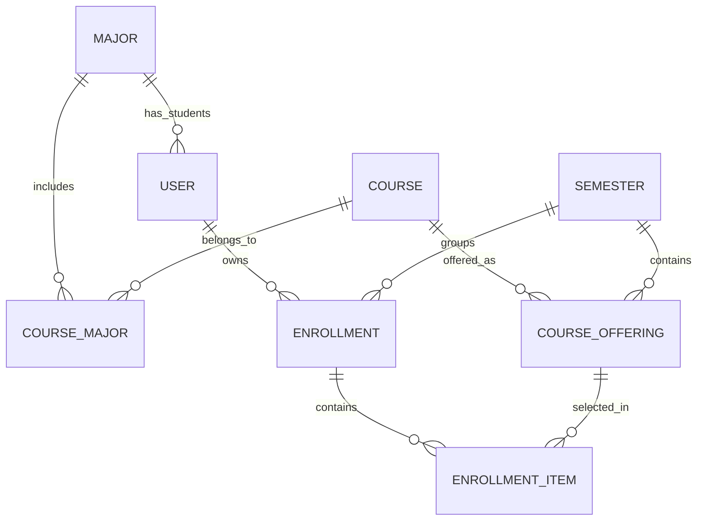

# Education System

A university course registration REST API built with Java and Spring Boot. Academic staff manage students, majors, courses, semesters, and course offerings. Students use their own enrollment records to discover eligible offerings, select courses, and remove selections.

The system applies enrollment plan rules, checks ownership and permissions, enforces offering capacity, and protects existing selections when academic data changes.

## Contents

- [Features and services](#features-and-services)
- [Technology stack](#technology-stack)
- [Domain model](#domain-model)
- [Getting started](#getting-started)
- [Authentication and permissions](#authentication-and-permissions)
- [API reference](#api-reference)
- [Registration walkthrough](#registration-walkthrough)
- [Enrollment rules and capacity](#enrollment-rules-and-capacity)
- [Responses and error handling](#responses-and-error-handling)
- [Architecture and consistency](#architecture-and-consistency)
- [Database migrations](#database-migrations)
- [Build and tests](#build-and-tests)
- [Current scope](#current-scope)

## Features and services

| Service | Responsibilities |
| --- | --- |
| Authentication | Log in with a university number and password; issue and validate JWT access tokens. |
| Users | Register students, list users, retrieve user details, update personal or administrative profile fields, and delete unreferenced users. |
| Majors | Create, list, read, rename, and delete majors. |
| Courses | Manage course names, codes, credit units, and the majors to which each course belongs. |
| Semesters | Manage semester titles and date ranges. |
| Course offerings | Offer a course in a semester, configure guest eligibility and capacity, and display enrollment counts. |
| Enrollments | Create a student's semester enrollment, assign its plan, inspect selections, change the plan, and delete an empty enrollment. |
| Student course selection | List eligible offerings, add a course, and remove a selected course from the authenticated student's enrollment. |

Administrative changes are checked against existing enrollments. A change that would invalidate a student's selections is rejected as a single transaction.

## Technology stack

| Component | Technology |
| --- | --- |
| Language | Java 21 |
| Application framework | Spring Boot 4.1.1, Spring Web MVC |
| Persistence | Spring Data JPA, Hibernate, PostgreSQL |
| Database migrations | Flyway |
| Request validation | Jakarta Bean Validation |
| Authentication | JJWT 0.13.0 with a custom servlet filter |
| Authorization | `@CheckPermission` and a Spring AOP aspect |
| DTO mapping | ModelMapper 3.2.6 |
| Boilerplate reduction | Lombok |
| Monitoring | Spring Boot Actuator |
| Build | Maven Wrapper |
| Local database | PostgreSQL 17 through Docker Compose |

## Domain model

| Entity | Meaning |
| --- | --- |
| `User` | A university account with a user type, roles, and profile information. A student must belong to a major. |
| `Role` / `Permission` | Named groups of permissions used to authorize API operations. |
| `Major` | An academic major assigned to students and associated with courses. |
| `Course` | A catalog entry with a unique code and a positive number of credit units. |
| `CourseMajor` | The association between a course and one of its permitted majors. |
| `Semester` | A named academic term with start and end dates. |
| `CourseOffering` | A course offered in a specific semester, with its own capacity and guest eligibility. |
| `Enrollment` | One student's registration record for one semester, including the enrollment plan. |
| `EnrollmentItem` | One course offering selected within an enrollment. |



The major-to-user relationship above describes students; other user types may have no major. A course can belong to multiple majors. There is one offering per course and semester, and one enrollment per student and semester.

## Getting started

### Prerequisites

- JDK 21, with `JAVA_HOME` pointing to that JDK.
- Docker with Docker Compose, or an existing PostgreSQL instance.
- Git. Maven is supplied by the repository's wrapper.
- OpenSSL for the JWT key generation command below, or another way to generate a Base64-encoded random key.

### 1. Clone the repository

```bash
git clone https://github.com/mohsenghorbanipour/Education-System.git
cd Education-System
```

### 2. Start PostgreSQL

```bash
docker compose up -d postgres
docker compose ps
```

The supplied [Compose file](docker-compose.yaml) runs the database only; the application runs separately through Maven or Java.

| Setting | Local value |
| --- | --- |
| Database host | `localhost` |
| Host port | `5433` |
| Container port | `5432` |
| Database name | `university_db` |
| Database user | `university_app` |
| Password | The `POSTGRES_PASSWORD` value configured in `docker-compose.yaml` |

Database files are stored in the `postgres_data` named volume. `docker compose stop` stops the database while preserving that data. Changing `POSTGRES_PASSWORD` in Compose after database initialization does not change the password stored in an existing database volume.

### 3. Configure the application

Defaults are defined in [application.yaml](src/main/resources/application.yaml). The following Bash commands override database settings and the JWT secret for the current terminal:

```bash
export SPRING_DATASOURCE_URL='jdbc:postgresql://localhost:5433/university_db'
export SPRING_DATASOURCE_USERNAME='university_app'
export SPRING_DATASOURCE_PASSWORD='<POSTGRES_PASSWORD from your Compose configuration>'
export JWT_SECRET="$(openssl rand -base64 64 | tr -d '\n')"
```

Replace the password placeholder with the actual password of your local database. If using an existing PostgreSQL server, set the URL, username, and password to match it. Keep the JWT secret stable across restarts if existing tokens should remain valid.

| Application property | Purpose |
| --- | --- |
| `spring.datasource.url` | PostgreSQL JDBC URL. |
| `spring.datasource.username` / `spring.datasource.password` | Database credentials. |
| `jwt.secret` | Base64-encoded signing key; the command above generates 64 random bytes. |
| `jwt.expirationMS` | Access token lifetime in milliseconds; the configured value is `3600000` (one hour). |
| `server.port` | HTTP port; defaults to `8080` and can be overridden with `SERVER_PORT`. |

Spring Boot does not automatically load a project `.env` file. The current Compose file also uses literal database settings rather than `${...}` references, so adding values to `.env` alone does not override those settings. Set application environment variables in the launching terminal or IDE run configuration.

### 4. Run the application

```bash
./mvnw spring-boot:run
```

On Windows, use `mvnw.cmd` in place of `./mvnw` and configure environment variables in your terminal or IDE. On Unix systems, use `chmod +x mvnw` if the wrapper is not executable.

Flyway applies migrations at startup, and Hibernate validates the resulting schema. The API base URL is:

```text
http://localhost:8080/api/v1
```

The Actuator health endpoint is available separately at `http://localhost:8080/actuator/health`.

### 5. Log in with the development administrator

The [development seed migration](src/main/resources/db/migration/V3__seed_development_admin_md5.sql) creates an enabled user with the `ADMIN` role:

| Field | Development value |
| --- | --- |
| University number | `9999999999` |
| Password | `Admin@123456` |

```bash
curl -X POST http://localhost:8080/api/v1/auth/login \
  -H 'Content-Type: application/json' \
  -d '{"universityNumber":"9999999999","password":"Admin@123456"}'
```

Copy `data.token` from the response and supply it on authenticated requests:

```bash
export ADMIN_TOKEN='<data.token from the login response>'

curl http://localhost:8080/api/v1/majors \
  -H "Authorization: Bearer $ADMIN_TOKEN"
```

These are development credentials. The current implementation uses MD5 password hashes and a seeded administrator; it should not be deployed as a production authentication system without replacing that password storage and bootstrap setup.

## Authentication and permissions

Requests under `/api/*` pass through `JwtFilter`. Authentication routes under `/api/v1/auth` are exempt; student registration requires authentication and the `STUDENT_USER_CREATE` permission.

```http
Authorization: Bearer <access-token>
```

Tokens identify a user by UUID. The filter loads the current account, rejects disabled accounts, and makes that user available to controllers. `PermissionAspect` then checks for the exact permission named by `@CheckPermission` across the user's roles.

`userType` and role are separate concepts. User types are `STUDENT`, `EMPLOYEE`, and `PROFESSOR`; the seeded administrator has user type `EMPLOYEE` and role `ADMIN`.

| Seeded role | Access relevant to the implemented endpoints |
| --- | --- |
| `ADMIN` | All seeded permissions, including administrative user management. |
| `EMPLOYEE` | Register students; manage majors, courses, semesters, offerings, and enrollment records; update its own profile. |
| `PROFESSOR` | Read majors, courses, semesters, and offerings; update its own profile. |
| `STUDENT` | Read majors and semesters; update its own profile; read its own enrollments and add or remove its own selections. |

The endpoint permission tables below are authoritative. For example, the seeded `EMPLOYEE` role has `STUDENT_USER_READ`, but `/users` requires `USER_READ`; those names are not interchangeable.

Student accounts cannot use the general course or offering list/detail endpoints, even if they have the corresponding read permission. They must use the enrollment-specific available-offerings endpoint, which applies their plan, major, current selections, and remaining capacity. Self-service routes derive the user ID from the token; callers cannot choose another user's ID in the request body.

## API reference

### Interactive Swagger documentation

- Local UI: `http://localhost:8080/swagger-ui/index.html`
- Public UI after deploying the application and updated Nginx configuration: `https://api.mohsendev20.ir/swagger-ui/index.html`
- OpenAPI JSON: `/v3/api-docs`

Expand **Authentication → Login**, select **Try it out**, and submit your own
application credentials. Copy `data.token`, click **Authorize**, and paste the
JWT without the `Bearer` prefix. You can then execute protected requests using
your account's permissions. Authorization is not persisted across page reloads.
The UI uses the current site's origin, so local testing stays local and the
public UI targets the server. Executing write operations changes that database.

Request/response schemas and validation constraints are generated from the
controllers and DTOs. Required permissions are included in operation descriptions;
server-injected current-user arguments are hidden. Documentation is public, while
API authentication, permission checks, and ownership rules remain enforced.

See [Swagger deployment instructions](deploy/PUBLIC_API.md#swagger-ui) for the
one-time Nginx update; deploying a JAR does not update Nginx files.

For remote frontend development, follow the [public HTTPS API guide](deploy/PUBLIC_API.md).
The API's CORS configuration allows `http://localhost:5173` by default and can
be changed with the comma-separated `CORS_ALLOWED_ORIGINS` environment variable.
Preflight requests are handled before JWT authentication; actual requests
still require the permissions listed below.

All paths below are relative to `/api/v1`. Bodies and responses use JSON. Resource IDs are UUIDs. Creation endpoints return `201 Created`; successful reads, updates, login, and deletes return `200 OK`. Deletes return a response envelope with a message.

List endpoints accept zero-based `page` and `size` parameters. Defaults are `page=0` and `size=20`; `size` must be between 1 and 100. Results are returned as arrays in `data`, without total-count or total-page metadata.

### Authentication and users

| Method | Path | Permission | Behavior |
| --- | --- | --- | --- |
| POST | `/auth/login` | Public | Authenticate and return user details with a JWT in `data.token`. |
| POST | `/users/register-student` | `STUDENT_USER_CREATE` | Create an enabled student with the `STUDENT` role and a major. |
| GET | `/users` | `USER_READ` | List users. |
| GET | `/users/{userId}` | `USER_READ` | Retrieve a user's details. |
| PATCH | `/users/me/profile` | `PROFILE_UPDATE_SELF` | Update the authenticated user's profile. |
| PATCH | `/users/{userId}/profile` | `USER_UPDATE` | Administratively update another user's profile. |
| DELETE | `/users/{userId}` | `USER_DELETE` | Delete a user with no enrollment records. |

Self-profile updates accept `firstName`, `lastName`, `nationalCode`, and `mobileNumber`. Administrative profile updates additionally accept `universityNumber` and `majorId`. Omitted or `null` fields are left unchanged. Profile requests do not change roles, passwords, or account status.

### Majors

| Method | Path | Permission | Behavior |
| --- | --- | --- | --- |
| POST | `/majors` | `MAJOR_CREATE` | Create a major with a unique name. |
| GET | `/majors` | `MAJOR_READ` | List majors. |
| GET | `/majors/{majorId}` | `MAJOR_READ` | Retrieve a major. |
| PATCH | `/majors/{majorId}` | `MAJOR_UPDATE` | Rename a major; `name` is required. |
| DELETE | `/majors/{majorId}` | `MAJOR_DELETE` | Delete a major that is not assigned to users or courses. |

### Courses

| Method | Path | Permission | Behavior |
| --- | --- | --- | --- |
| POST | `/courses` | `COURSE_CREATE` | Create a course and its major associations. |
| GET | `/courses` | `COURSE_READ` | List catalog courses; non-student accounts only. |
| GET | `/courses/{courseId}` | `COURSE_READ` | Retrieve a course and its majors; non-student accounts only. |
| PATCH | `/courses/{courseId}` | `COURSE_UPDATE` | Update name, code, credit units, or the set of majors. |
| DELETE | `/courses/{courseId}` | `COURSE_DELETE` | Delete a course with no offerings. |

`majorIds` is a JSON array of UUIDs. When supplied on update, it replaces the set of course-major associations. At least one major is required.

### Semesters

| Method | Path | Permission | Behavior |
| --- | --- | --- | --- |
| POST | `/semesters` | `SEMESTER_CREATE` | Create a semester with a unique title and valid date range. |
| GET | `/semesters` | `SEMESTER_READ` | List semesters. |
| GET | `/semesters/{semesterId}` | `SEMESTER_READ` | Retrieve a semester. |
| PATCH | `/semesters/{semesterId}` | `SEMESTER_UPDATE` | Update title, start date, or end date. |
| DELETE | `/semesters/{semesterId}` | `SEMESTER_DELETE` | Delete a semester with no offerings or enrollments. |

Dates use `YYYY-MM-DD`. The end date must be after the start date; a semester title may contain up to 10 characters.

### Course offerings

| Method | Path | Permission | Behavior |
| --- | --- | --- | --- |
| POST | `/course-offerings` | `COURSE_OFFERING_CREATE` | Offer a course in a semester with capacity and guest eligibility. |
| GET | `/course-offerings` | `COURSE_OFFERING_READ` | List offerings, optionally filtered by `semesterId`; non-student accounts only. |
| GET | `/course-offerings/{courseOfferingId}` | `COURSE_OFFERING_READ` | Retrieve an offering; non-student accounts only. |
| PATCH | `/course-offerings/{courseOfferingId}` | `COURSE_OFFERING_UPDATE` | Update course, semester, guest eligibility, or capacity. |
| DELETE | `/course-offerings/{courseOfferingId}` | `COURSE_OFFERING_DELETE` | Delete an offering that has no student selections. |

An offering that is already selected cannot be moved to a different course or semester. Capacity and guest eligibility changes are validated against existing selections.

### Administrative enrollments

| Method | Path | Permission | Behavior |
| --- | --- | --- | --- |
| POST | `/enrollments` | `ENROLLMENT_CREATE` | Create a student's semester enrollment and assign its plan. |
| GET | `/enrollments` | `ENROLLMENT_READ` | List enrollments; optional `userId` and `semesterId` filters. |
| GET | `/enrollments/{enrollmentId}` | `ENROLLMENT_READ` | Retrieve selections and total credit units. |
| PATCH | `/enrollments/{enrollmentId}` | `ENROLLMENT_UPDATE` | Change `planType` if existing selections satisfy the new plan. |
| DELETE | `/enrollments/{enrollmentId}` | `ENROLLMENT_DELETE` | Delete an empty enrollment. |

An administrator or another account with `ENROLLMENT_CREATE` assigns the plan. There is no student self-creation endpoint for enrollment records.

### Student enrollments and selections

| Method | Path | Permission | Behavior |
| --- | --- | --- | --- |
| GET | `/enrollments/me` | `ENROLLMENT_READ_SELF` | List the current user's enrollments; optional `semesterId` filter. |
| GET | `/enrollments/me/{enrollmentId}` | `ENROLLMENT_READ_SELF` | Retrieve an owned enrollment, its items, and total credit units. |
| GET | `/enrollments/me/{enrollmentId}/available-course-offerings` | `ENROLLMENT_READ_SELF` | List offerings that can currently be added to this enrollment. |
| POST | `/enrollments/me/{enrollmentId}/items` | `ENROLLMENT_ADD_COURSE_SELF` | Select an offering using `courseOfferingId`. |
| DELETE | `/enrollments/me/{enrollmentId}/items/{itemId}` | `ENROLLMENT_REMOVE_COURSE_SELF` | Remove a selected item and release its seat. |

Ownership is checked by the service. A missing enrollment or one belonging to another user returns `ENROLLMENT_NOT_FOUND`. The delete route takes the **enrollment item ID**, not the course ID or offering ID.

## Registration walkthrough

Run steps 1-6 with an administrator token. In the JSON below, replace every `<...>` placeholder with a UUID returned by an earlier request. Send `Content-Type: application/json` and the appropriate bearer token.

### 1. Create a major

`POST /api/v1/majors`

```json
{
  "name": "Computer Science"
}
```

### 2. Register a student

`POST /api/v1/users/register-student`

```json
{
  "firstName": "Alex",
  "lastName": "Taylor",
  "universityNumber": "1234567890",
  "nationalCode": "1234567890",
  "mobileNumber": "09123456789",
  "password": "Student@123456",
  "majorId": "<majorId>"
}
```

University numbers and national codes must contain exactly 10 digits; mobile numbers must contain exactly 11 digits. Each of these fields must be unique among users. First and last names are required and limited to 100 characters each.

### 3. Create a course

`POST /api/v1/courses`

```json
{
  "name": "Introduction to Programming",
  "code": "CS101",
  "creditUnits": 3,
  "majorIds": ["<majorId>"]
}
```

### 4. Create a semester

`POST /api/v1/semesters`

```json
{
  "title": "2026-FALL",
  "startDate": "2026-09-23",
  "endDate": "2027-01-20"
}
```

### 5. Offer the course

`POST /api/v1/course-offerings`

```json
{
  "courseId": "<courseId>",
  "semesterId": "<semesterId>",
  "guestAllowed": true,
  "capacity": 50
}
```

### 6. Create the student's enrollment

`POST /api/v1/enrollments`

```json
{
  "userId": "<studentUserId>",
  "semesterId": "<semesterId>",
  "planType": "REGULAR"
}
```

### 7. Log in as the student and discover eligible offerings

Log in through `/api/v1/auth/login` using the student's university number and password. Use that student's token for the remaining requests:

```http
GET /api/v1/enrollments/me
GET /api/v1/enrollments/me/{enrollmentId}/available-course-offerings?page=0&size=20
Authorization: Bearer <student-token>
```

These are two separate requests. The available-offerings response includes course and semester details, guest eligibility, and capacity information.

### 8. Select, inspect, and remove a course

`POST /api/v1/enrollments/me/{enrollmentId}/items`

```json
{
  "courseOfferingId": "<courseOfferingId>"
}
```

Save the returned `data.id` as the enrollment item ID. Retrieve the full enrollment with `GET /api/v1/enrollments/me/{enrollmentId}`. Its `data.items` contains the selected offerings, and `data.totalCreditUnits` contains their combined credits.

To remove that selection, call `DELETE /api/v1/enrollments/me/{enrollmentId}/items/{itemId}` using the saved item ID.

## Enrollment rules and capacity

### Plans

The plan belongs to an enrollment, so it can differ between semesters for the same student.

| Plan | Maximum credit units | Course eligibility |
| --- | --- | --- |
| `REGULAR` | 24 | Courses associated with the student's major. |
| `PROBATION` | 14 | Courses associated with the student's major. |
| `HONORS` | 28 | Courses from the student's major, plus at most one course outside it. |
| `GUEST` | 20 | Only offerings with `guestAllowed=true`; the plan does not restrict selection to the student's major. |

Every selection must belong to the enrollment's semester. The same course cannot be selected twice within one enrollment. A student needs an enabled account and a major when the enrollment is created. Eligibility is checked against the complete selection, including the candidate course.

### Capacity

Capacity belongs to a **course offering**, not to the catalog course. The same course can have different capacities in different semesters. All students and plans selecting an offering share its capacity.

| Response field | Meaning |
| --- | --- |
| `capacity` | Positive integer stored on the offering. Required when creating an offering. |
| `enrolledCount` | Number of persisted selections for this offering. |
| `remainingCapacity` | `capacity - enrolledCount`. |

Only `capacity` is stored as a counter-like field; the other two values are calculated. Removing a selection releases a seat after the transaction commits. Capacity can be increased or reduced to the current enrollment count, but it cannot be reduced below that count.

Available offerings are filtered for eligibility and capacity **before pagination**. Seeing an offering in that list does not reserve a seat: the add operation checks capacity again inside its transaction. Administrative offering lists still include full offerings.

### Changes to existing data

Changing course credits, course-major associations, a student's major, or offering guest eligibility revalidates affected enrollments. An incompatible change returns `409 ENROLLMENT_CHANGE_CONFLICT` and rolls back the entire operation. Changing a plan also validates all existing selections before saving it.

Referenced academic records cannot be deleted. Remove the relevant dependencies first; for example, an enrollment must have no items before it can be deleted.

## Responses and error handling

Business endpoints use an `ApiResponse<T>` envelope. For example, creating a major returns:

```json
{
  "success": true,
  "message": null,
  "data": {
    "id": "d0119075-3f2a-407c-bd46-dfdf3f2f0bf4",
    "name": "Computer Science"
  },
  "code": null,
  "errors": [],
  "traceId": null
}
```

A validation failure uses the same envelope with field errors:

```json
{
  "success": false,
  "message": "Please check the submitted fields",
  "data": null,
  "code": "VALIDATION_FAILED",
  "errors": [
    {
      "field": "capacity",
      "message": "Capacity must be greater than zero"
    }
  ],
  "traceId": "e7cae0cd-7cd3-4a76-8640-d400ca6d9dd2"
}
```

Error responses include an `X-Request-Id` header matching `traceId`. Use the stable `code` value when implementing client behavior; `message` provides a readable explanation.

| HTTP status | Example codes | Meaning |
| --- | --- | --- |
| 400 | `INVALID_REQUEST`, `VALIDATION_FAILED`, `INVALID_SEMESTER_DATES` | Malformed input or invalid field values. |
| 401 | `AUTHENTICATION_REQUIRED`, `INVALID_CREDENTIALS`, `INVALID_TOKEN`, `TOKEN_EXPIRED` | Login or token authentication failed. |
| 403 | `ACCESS_DENIED`, `ACCOUNT_DISABLED` | Missing permission, restricted catalog access, or a disabled account. |
| 404 | `USER_NOT_FOUND`, `ENROLLMENT_NOT_FOUND`, `ENROLLMENT_ITEM_NOT_FOUND` | The requested resource was not found in the caller's scope. |
| 409 | `COURSE_CODE_ALREADY_EXISTS`, `ENROLLMENT_ALREADY_EXISTS`, `ENROLLMENT_DUPLICATE_COURSE` | A uniqueness or duplicate-selection conflict. |
| 409 | `ENROLLMENT_CREDIT_LIMIT_EXCEEDED`, `ENROLLMENT_COURSE_MAJOR_MISMATCH`, `ENROLLMENT_OUTSIDE_MAJOR_LIMIT_EXCEEDED`, `ENROLLMENT_GUEST_COURSE_NOT_ALLOWED` | Enrollment plan rules reject the selection. |
| 409 | `COURSE_OFFERING_CAPACITY_FULL`, `COURSE_OFFERING_CAPACITY_BELOW_ENROLLED_COUNT` | No remaining seats, or an invalid capacity reduction. |
| 409 | `ENROLLMENT_CHANGE_CONFLICT`, `MAJOR_IN_USE`, `COURSE_IN_USE`, `SEMESTER_IN_USE`, `USER_IN_USE` | An update or deletion conflicts with existing records. |
| 500 | `INTERNAL_ERROR` | An unexpected server failure. |

The complete list is defined in [ErrorCode.java](src/main/java/com/edu/com/common/exception/ErrorCode.java). HTTP-level errors such as unsupported methods or media types are also handled centrally.

## Architecture and consistency

```text
src/main/java/com/edu/com/
  common/       JWT filters, permission checks, responses, errors, shared entity fields
  user/         Authentication, users, roles, permissions, profiles
  major/        Major management
  course/       Catalog courses, course-major associations, semester offerings
  semester/     Academic term management
  enrollment/   Enrollment records, items, plan policies, integrity checks, locks
```

Each feature uses controllers, request/response DTOs, services, repositories, and entities. Controllers define the HTTP contract and permissions, services apply business rules and transaction boundaries, and repositories load and persist data. UUIDs, timestamps, and optimistic versions are provided by `BaseEntity`.

The four plan strategies implement [EnrollmentPlanPolicy](src/main/java/com/edu/com/enrollment/policy/EnrollmentPlanPolicy.java). [EnrollmentPlanValidator](src/main/java/com/edu/com/enrollment/service/EnrollmentPlanValidator.java) applies shared semester, duplicate-course, and credit-limit rules before invoking the selected strategy.

Consistency mechanisms include:

- Pessimistic row locks on enrollment and offering mutations. A capacity check and the corresponding selection are performed in the same transaction, so competing requests cannot both claim the last seat.
- PostgreSQL transaction-scoped advisory locks in [EnrollmentConsistencyLock](src/main/java/com/edu/com/enrollment/service/EnrollmentConsistencyLock.java). Enrollment mutations share the coordination lock; relevant administrative edits acquire it exclusively while validating affected records.
- [EnrollmentIntegrityService](src/main/java/com/edu/com/enrollment/service/EnrollmentIntegrityService.java), which validates affected enrollments after proposed academic changes and causes incompatible edits to roll back.
- Database uniqueness, foreign-key, and positive-capacity constraints, plus JPA optimistic versioning.
- Batched loading of course majors and enrollment counts, and snapshot reads for responses that combine offering capacity with counts. Open Session in View is disabled.

`ApiErrorFilter`, `GlobalExceptionHandler`, and `ApiErrorHandler` provide consistent errors across authentication filters and MVC controllers. PostgreSQL is required by the advisory-lock implementation as well as the migrations.

## Database migrations

Migrations are located in [src/main/resources/db/migration](src/main/resources/db/migration) and run automatically at startup.

| Version | Purpose |
| --- | --- |
| V1 | Create the initial academic schema. |
| V2 | Refactor students into users; add roles, permissions, and their seed assignments. |
| V3 | Seed the development administrator. |
| V4 | Add offering capacity and a positive-capacity constraint. |

V4 assigns each existing offering the greater of **50** and its current number of selections. Existing selections are preserved. New offerings require an explicit capacity.

For an existing database still at V1, V2 expects the old `students` table to be empty and deliberately rejects an upgrade with student data; such a database needs a planned data conversion before applying that migration. Fresh installations apply all migrations in order. Add new migrations for subsequent schema changes rather than editing applied migration files.

## Build and tests

With PostgreSQL running and the environment configured as above:

```bash
./mvnw clean verify
```

`EducationSystemApplicationTests` is an application-context smoke test. It loads the configured application and requires a reachable PostgreSQL database; Flyway runs as part of startup. Use a separate development or test database for this command. `FilterConfigTests` checks browser preflight handling, origin/header restrictions, and JWT authentication with CORS response headers, without a database.

`OpenApiTests` starts an HTTP server on a random port and verifies documentation, UI assets, JWT security metadata, hidden server-side parameters, validation schemas, and authentication enforcement. It also requires a separate PostgreSQL test database.

To run only the CORS and filter-chain tests:

```bash
./mvnw -Dtest=FilterConfigTests test
```

To package without executing tests:

```bash
./mvnw clean package -DskipTests
java -jar target/education-system-0.0.1-SNAPSHOT.jar
```

The executable JAR uses the same environment variables as the Maven run command.

## CI/CD

[GitHub Actions](.github/workflows/ci.yml) builds and tests pushes and pull
requests targeting `main`, using Java 21 and a temporary PostgreSQL 17 service.
Pushing a `v*` release tag also deploys that run's tested JAR to the configured
Ubuntu server. Release commits must be reachable from `main`.

The deployment uses a dedicated SSH account, verified host keys, and a
root-owned helper with a limited sudo rule. It verifies the uploaded checksum,
restarts the systemd service, and checks application health. On startup failure
it attempts to restore the previous JAR; database migrations are not reverted.

Follow the [deployment guide](deploy/README.md) to install the server helper,
configure the four Actions secrets, and publish a release.

## Current scope

This repository provides the backend API. Role and permission data are seeded in the database; dedicated management endpoints for them are not implemented. Some seeded permissions represent future operations and do not imply an existing endpoint. There is no frontend, refresh-token flow, or password-change endpoint in the current codebase.

Semester dates describe academic terms; the current selection logic does not enforce registration deadlines, timetables, prerequisites, or grading rules. The implemented rules are the plan, ownership, semester, duplicate-course, major, and capacity checks documented above.
